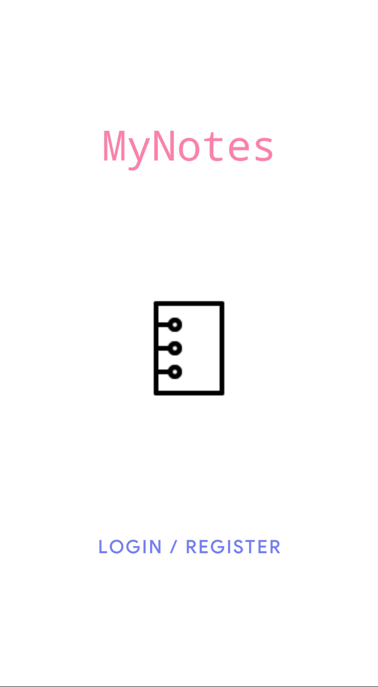
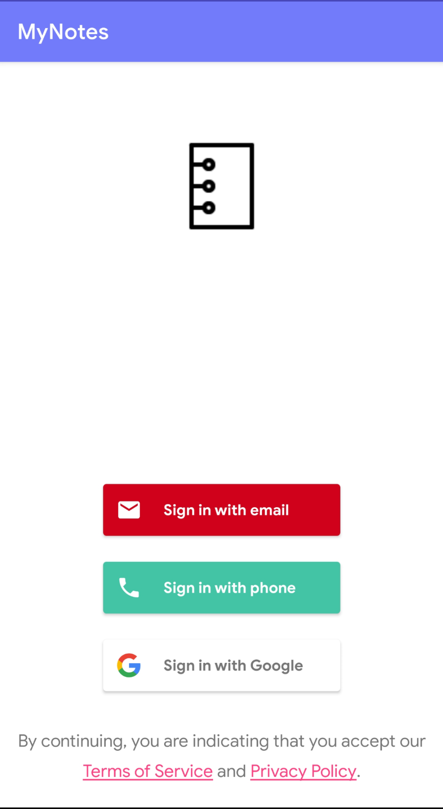
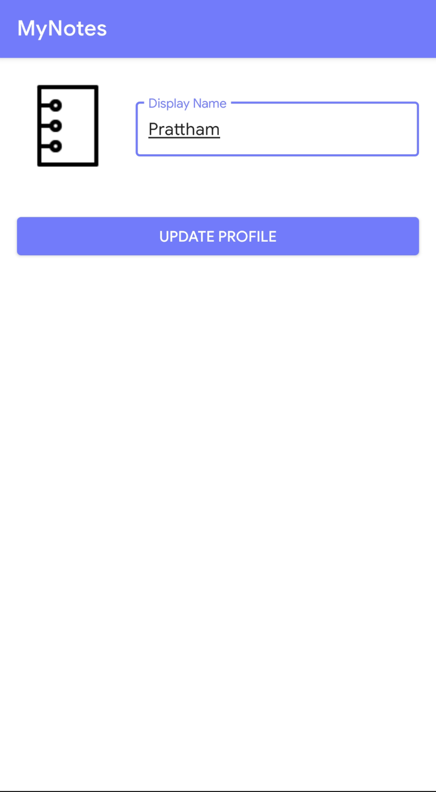
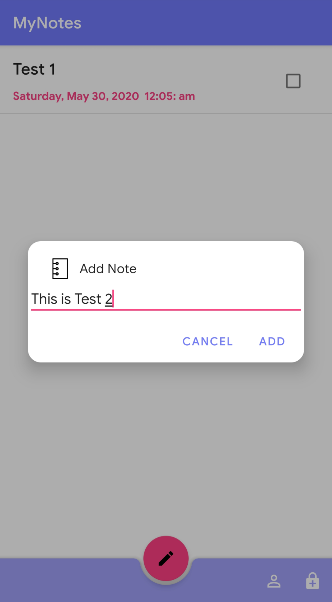
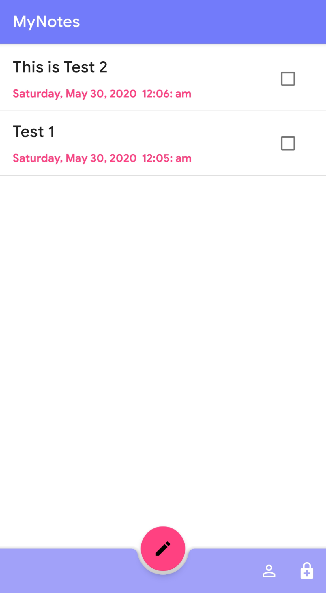
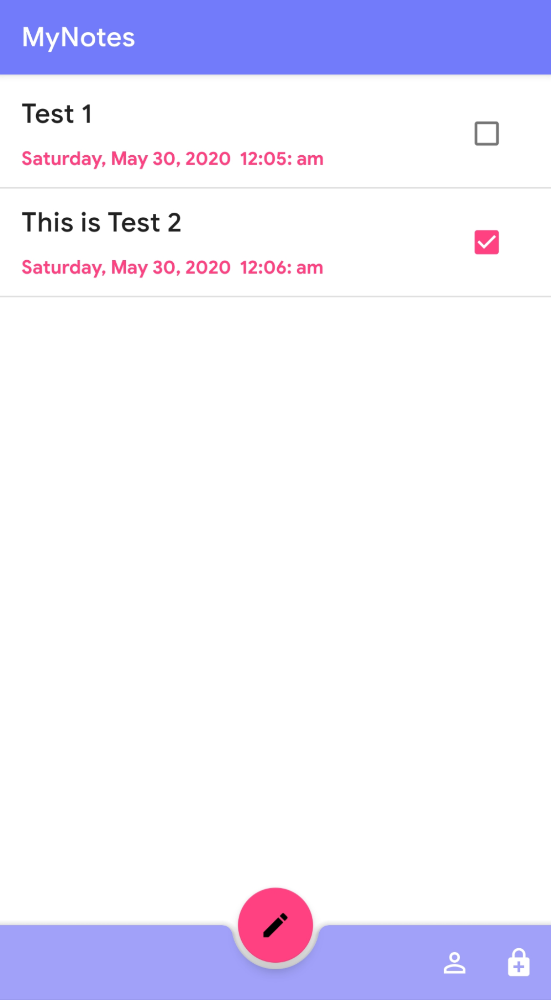
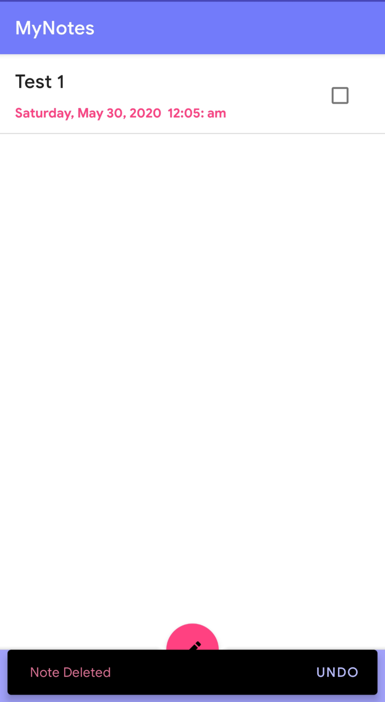

# MyNotes 
A Note taking app that uses Firebase Firestore as server and allows users to take quick notes with ability to mark them as done and also contains swipe gestures to delete the note. It allows users to Login via email and password or phone number with OTP verification and Login via Google. It uses new material design library and material components.

# Screenshots

  

  

  

